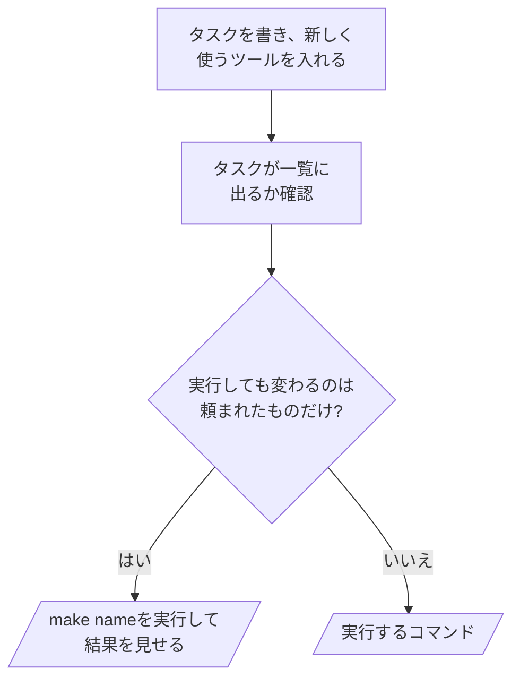

# task

コマンドを追加・変更して `make <name>` で動くようにする。

平行四辺形はユーザーに見えて、答えるもの。

```mermaid
flowchart TD
  write[タスクを書き、新しく<br/>使うツールを入れる]
  write --> listed[タスクが一覧に<br/>出るか確認]
  listed --> safe{実行しても変わるのは<br/>頼まれたものだけ?}
  safe -- "はい" --> run[/make nameを実行して<br/>結果を見せる/]
  safe -- "いいえ" --> tell[/実行するコマンド/]
```
