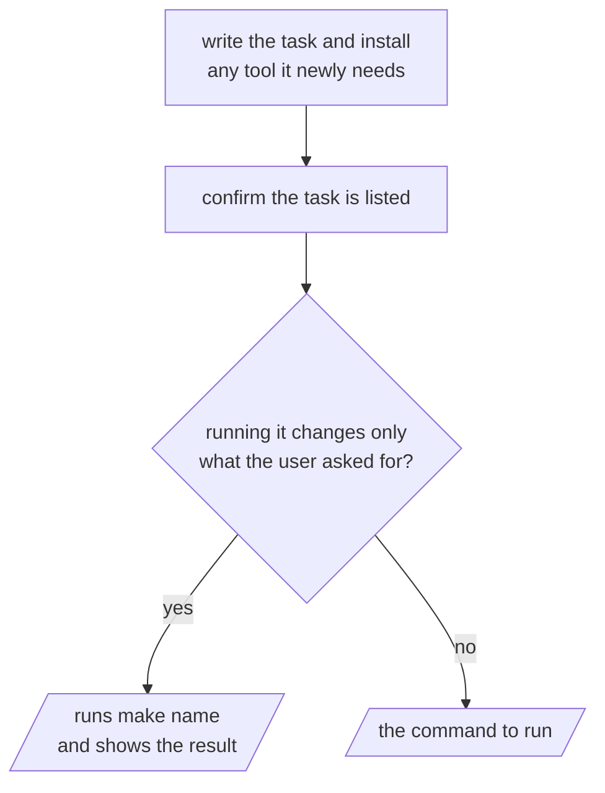

# task

Adds or changes a command so it runs as `make <name>`.

Parallelograms are what the user sees and answers.

```mermaid
flowchart TD
  write[write the task and install<br/>any tool it newly needs]
  write --> listed[confirm the task is listed]
  listed --> safe{running it changes only<br/>what the user asked for?}
  safe -- "yes" --> run[/runs make name<br/>and shows the result/]
  safe -- "no" --> tell[/the command to run/]
```
