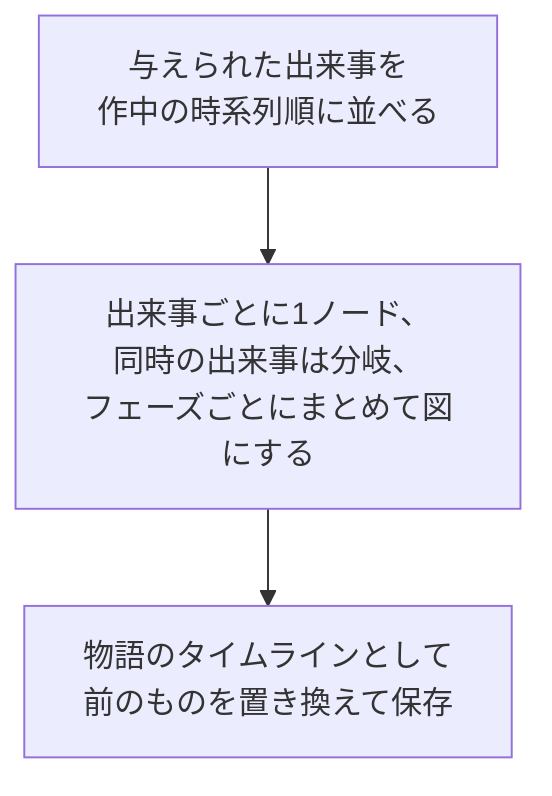

# timeline

ユーザーが説明した出来事を作中の時系列順に並べ、イベントの流れ図にする。

平行四辺形はユーザーに見えて、答えるもの。

```mermaid
flowchart TD
  sort[与えられた出来事を<br/>作中の時系列順に並べる]
  sort --> draw["出来事ごとに1ノード、<br/>同時の出来事は分岐、<br/>フェーズごとにまとめて図にする"]
  draw --> save[物語のタイムラインとして<br/>前のものを置き換えて保存]
```
