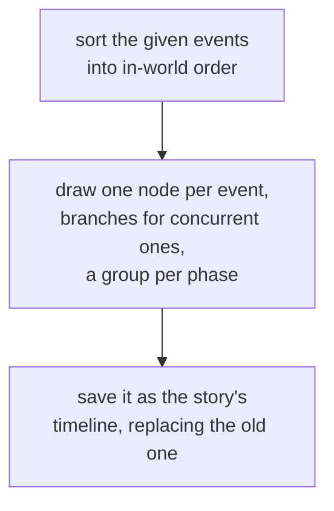

# timeline

Arranges the events the user describes into in-world chronological order as an event flow diagram.

Parallelograms are what the user sees and answers.

```mermaid
flowchart TD
  sort[sort the given events<br/>into in-world order]
  sort --> draw["draw one node per event,<br/>branches for concurrent ones,<br/>a group per phase"]
  draw --> save[save it as the story's<br/>timeline, replacing the old one]
```
