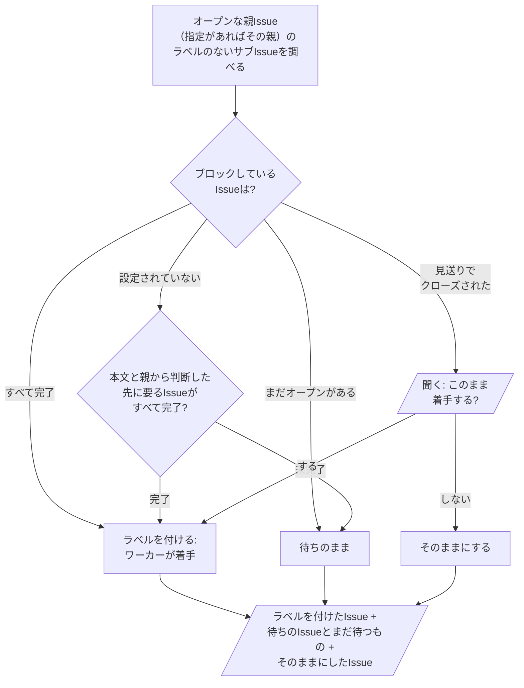

# unblock

```mermaid
flowchart TD
  scan[オープンな親Issue<br/>（指定があればその親）の<br/>ラベルのないサブIssueを調べる]
  scan --> state{ブロックしている<br/>Issueは?}
  state -- "すべて完了" --> label[ラベルを付ける:<br/>ワーカーが着手]
  state -- "まだオープンがある" --> waiting[待ちのまま]
  state -- "見送りで<br/>クローズされた" --> ask[/聞く: このまま<br/>着手する?/]
  state -- "設定されていない" --> judge{本文と親から判断した<br/>先に要るIssueが<br/>すべて完了?}
  judge -- "完了" --> label
  judge -- "未完了" --> waiting
  ask -- "する" --> label
  ask -- "しない" --> keep[そのままにする]
  label --> report[/"ラベルを付けたIssue +<br/>待ちのIssueとまだ待つもの +<br/>そのままにしたIssue"/]
  waiting --> report
  keep --> report
```
