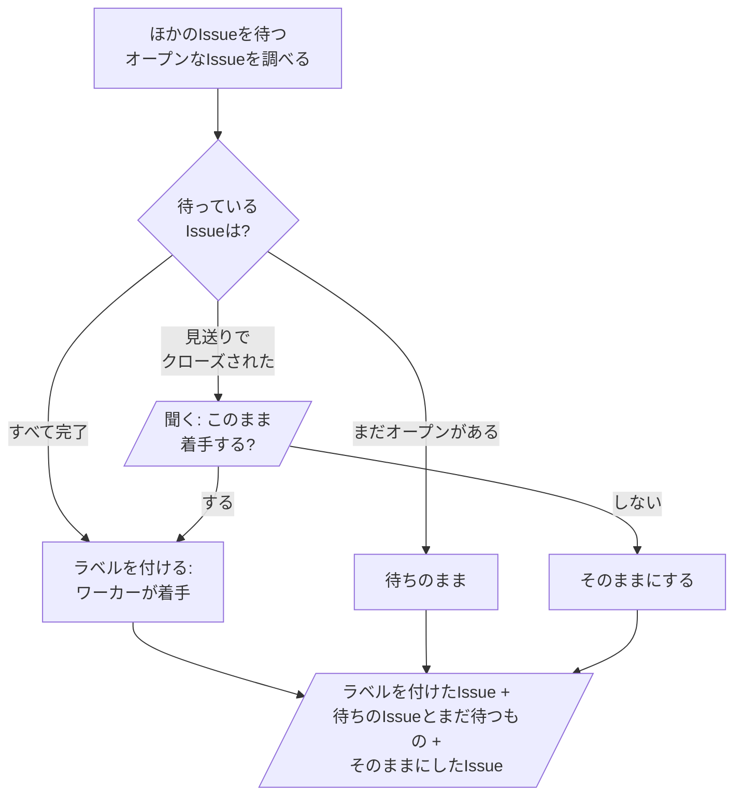

# unblock

```mermaid
flowchart TD
  scan[ほかのIssueを待つ<br/>オープンなIssueを調べる]
  scan --> state{待っている<br/>Issueは?}
  state -- "すべて完了" --> label[ラベルを付ける:<br/>ワーカーが着手]
  state -- "まだオープンがある" --> waiting[待ちのまま]
  state -- "見送りで<br/>クローズされた" --> ask[/聞く: このまま<br/>着手する?/]
  ask -- "する" --> label
  ask -- "しない" --> keep[そのままにする]
  label --> report[/"ラベルを付けたIssue +<br/>待ちのIssueとまだ待つもの +<br/>そのままにしたIssue"/]
  waiting --> report
  keep --> report
```
