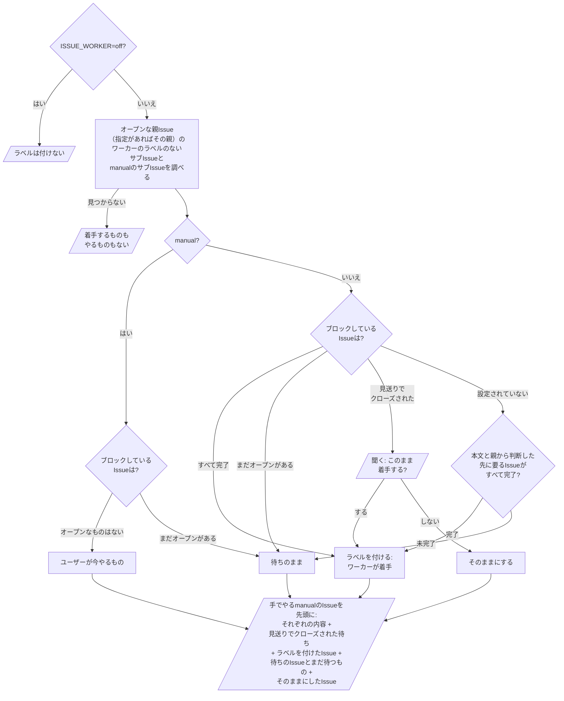

# unblock

```mermaid
flowchart TD
  off{ISSUE_WORKER=off?} -- "はい" --> offr[/ラベルは付けない/]
  off -- "いいえ" --> scan
  scan[オープンな親Issue<br/>（指定があればその親）の<br/>ワーカーのラベルのない<br/>サブIssueと<br/>manualのサブIssueを調べる]
  scan -- "見つからない" --> none[/着手するものも<br/>やるものもない/]
  scan --> kind{manual?}
  kind -- "はい" --> mstate{ブロックしている<br/>Issueは?}
  mstate -- "オープンなものはない" --> yours[ユーザーが今やるもの]
  mstate -- "まだオープンがある" --> waiting
  kind -- "いいえ" --> state{ブロックしている<br/>Issueは?}
  state -- "すべて完了" --> label[ラベルを付ける:<br/>ワーカーが着手]
  state -- "まだオープンがある" --> waiting[待ちのまま]
  state -- "見送りで<br/>クローズされた" --> ask[/聞く: このまま<br/>着手する?/]
  state -- "設定されていない" --> judge{本文と親から判断した<br/>先に要るIssueが<br/>すべて完了?}
  judge -- "完了" --> label
  judge -- "未完了" --> waiting
  ask -- "する" --> label
  ask -- "しない" --> keep[そのままにする]
  yours --> report[/"手でやるmanualのIssueを先頭に:<br/>それぞれの内容 +<br/>見送りでクローズされた待ち<br/>+ ラベルを付けたIssue +<br/>待ちのIssueとまだ待つもの +<br/>そのままにしたIssue"/]
  label --> report
  waiting --> report
  keep --> report
```
