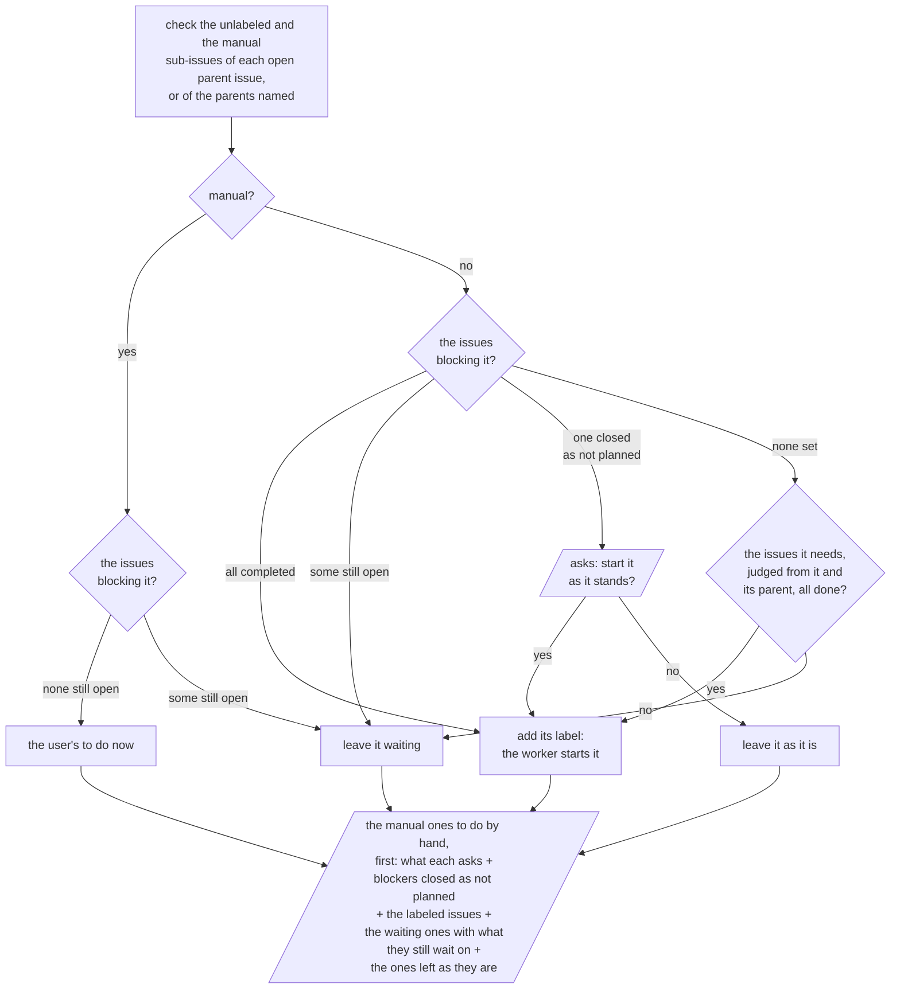

# unblock

```mermaid
flowchart TD
  scan[check the unlabeled and the manual<br/>sub-issues of each open parent issue,<br/>or of the parents named]
  scan --> kind{manual?}
  kind -- "yes" --> mstate{the issues<br/>blocking it?}
  mstate -- "none still open" --> yours[the user's to do now]
  mstate -- "some still open" --> waiting
  kind -- "no" --> state{the issues<br/>blocking it?}
  state -- "all completed" --> label[add its label:<br/>the worker starts it]
  state -- "some still open" --> waiting[leave it waiting]
  state -- "one closed<br/>as not planned" --> ask[/asks: start it<br/>as it stands?/]
  state -- "none set" --> judge{the issues it needs,<br/>judged from it and<br/>its parent, all done?}
  judge -- "yes" --> label
  judge -- "no" --> waiting
  ask -- "yes" --> label
  ask -- "no" --> keep[leave it as it is]
  yours --> report[/"the manual ones to do by hand,<br/>first: what each asks +<br/>blockers closed as not planned<br/>+ the labeled issues +<br/>the waiting ones with what<br/>they still wait on +<br/>the ones left as they are"/]
  label --> report
  waiting --> report
  keep --> report
```
