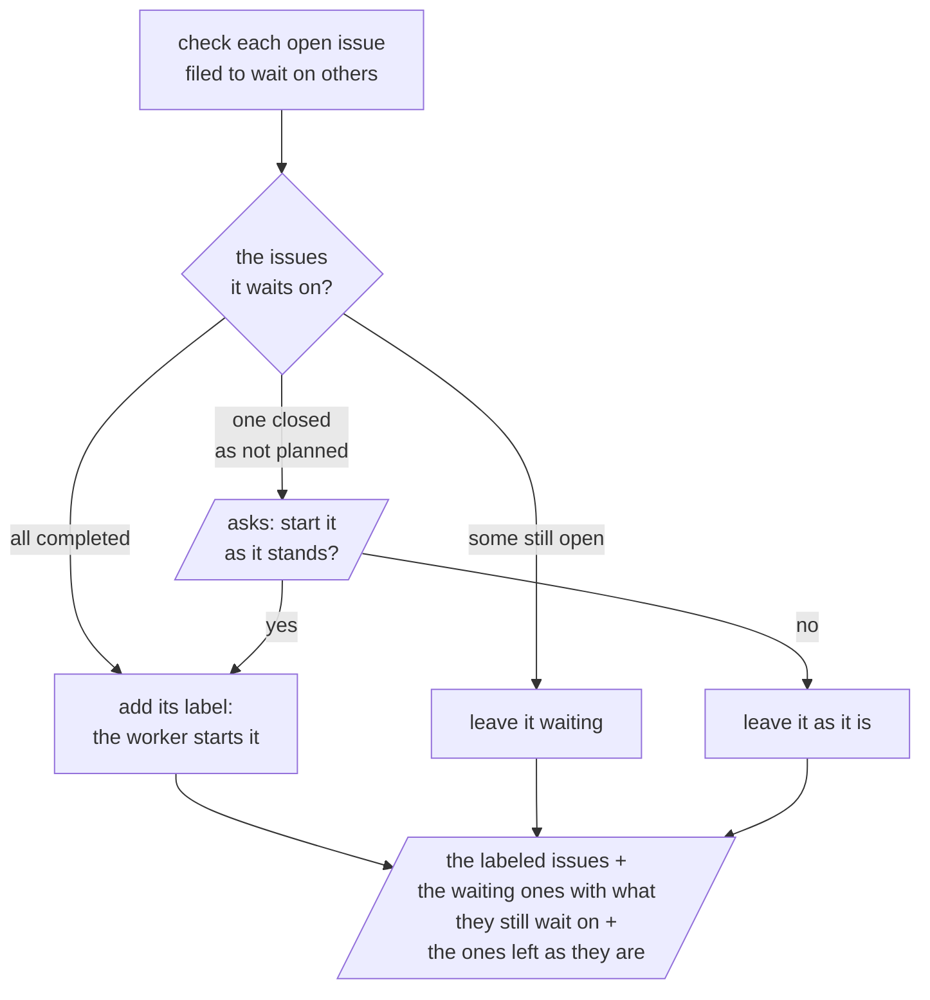

# unblock

```mermaid
flowchart TD
  scan[check each open issue<br/>filed to wait on others]
  scan --> state{the issues<br/>it waits on?}
  state -- "all completed" --> label[add its label:<br/>the worker starts it]
  state -- "some still open" --> waiting[leave it waiting]
  state -- "one closed<br/>as not planned" --> ask[/asks: start it<br/>as it stands?/]
  ask -- "yes" --> label
  ask -- "no" --> keep[leave it as it is]
  label --> report[/"the labeled issues +<br/>the waiting ones with what<br/>they still wait on +<br/>the ones left as they are"/]
  waiting --> report
  keep --> report
```
