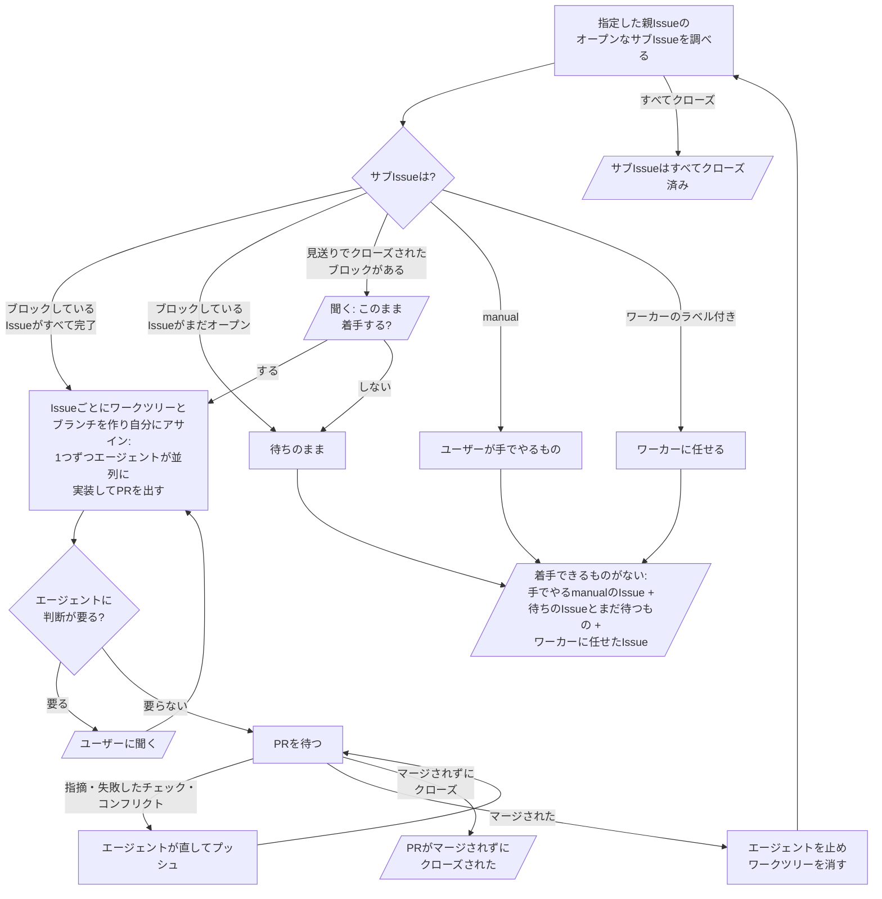

# work-issues

```mermaid
flowchart TD
  scan[指定した親Issueの<br/>オープンなサブIssueを調べる]
  scan --> kind{サブIssueは?}
  kind -- "ブロックしている<br/>Issueがすべて完了" --> start[Issueごとにワークツリーと<br/>ブランチを作り自分にアサイン:<br/>1つずつエージェントが並列に<br/>実装してPRを出す]
  kind -- "ブロックしている<br/>Issueがまだオープン" --> waiting[待ちのまま]
  kind -- "見送りでクローズされた<br/>ブロックがある" --> ask[/聞く: このまま<br/>着手する?/]
  kind -- "manual" --> manual[ユーザーが手でやるもの]
  kind -- "ワーカーのラベル付き" --> worker[ワーカーに任せる]
  ask -- "する" --> start
  ask -- "しない" --> waiting
  start --> question{エージェントに<br/>判断が要る?}
  question -- "要る" --> answer[/ユーザーに聞く/]
  answer --> start
  question -- "要らない" --> pr[PRを待つ]
  pr -- "指摘・失敗したチェック・<br/>コンフリクト" --> fix[エージェントが直してプッシュ]
  fix --> pr
  pr -- "マージされた" --> stop[エージェントを止め<br/>ワークツリーを消す]
  stop --> scan
  pr -- "マージされずに<br/>クローズ" --> closed[/PRがマージされずに<br/>クローズされた/]
  waiting --> report[/"着手できるものがない:<br/>手でやるmanualのIssue +<br/>待ちのIssueとまだ待つもの +<br/>ワーカーに任せたIssue"/]
  manual --> report
  worker --> report
  scan -- "すべてクローズ" --> done[/サブIssueはすべてクローズ済み/]
```
