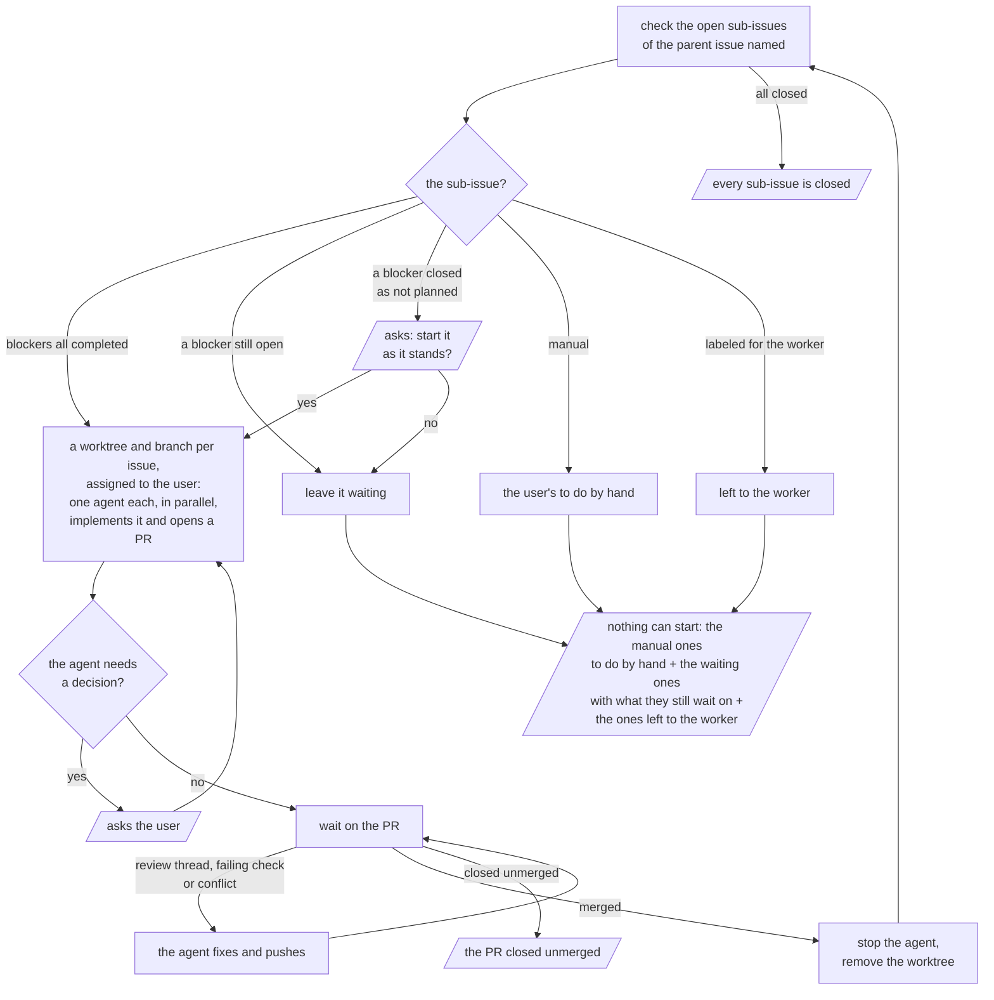

# work-issues

```mermaid
flowchart TD
  scan[check the open sub-issues<br/>of the parent issue named]
  scan --> kind{the sub-issue?}
  kind -- "blockers all completed" --> start[a worktree and branch per issue,<br/>assigned to the user:<br/>one agent each, in parallel,<br/>implements it and opens a PR]
  kind -- "a blocker still open" --> waiting[leave it waiting]
  kind -- "a blocker closed<br/>as not planned" --> ask[/asks: start it<br/>as it stands?/]
  kind -- "manual" --> manual[the user's to do by hand]
  kind -- "labeled for the worker" --> worker[left to the worker]
  ask -- "yes" --> start
  ask -- "no" --> waiting
  start --> question{the agent needs<br/>a decision?}
  question -- "yes" --> answer[/asks the user/]
  answer --> start
  question -- "no" --> pr[wait on the PR]
  pr -- "review thread, failing check<br/>or conflict" --> fix[the agent fixes and pushes]
  fix --> pr
  pr -- "merged" --> stop[stop the agent,<br/>remove the worktree]
  stop --> scan
  pr -- "closed unmerged" --> closed[/the PR closed unmerged/]
  waiting --> report[/"nothing can start: the manual ones<br/>to do by hand + the waiting ones<br/>with what they still wait on +<br/>the ones left to the worker"/]
  manual --> report
  worker --> report
  scan -- "all closed" --> done[/every sub-issue is closed/]
```
